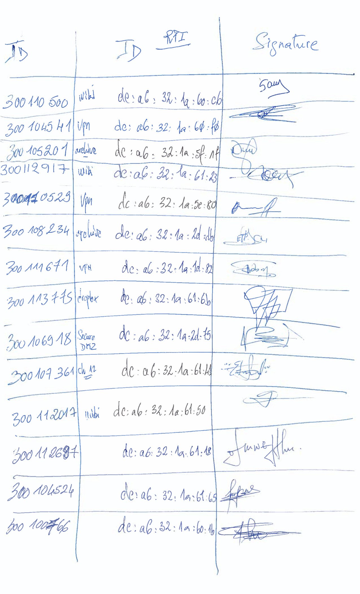
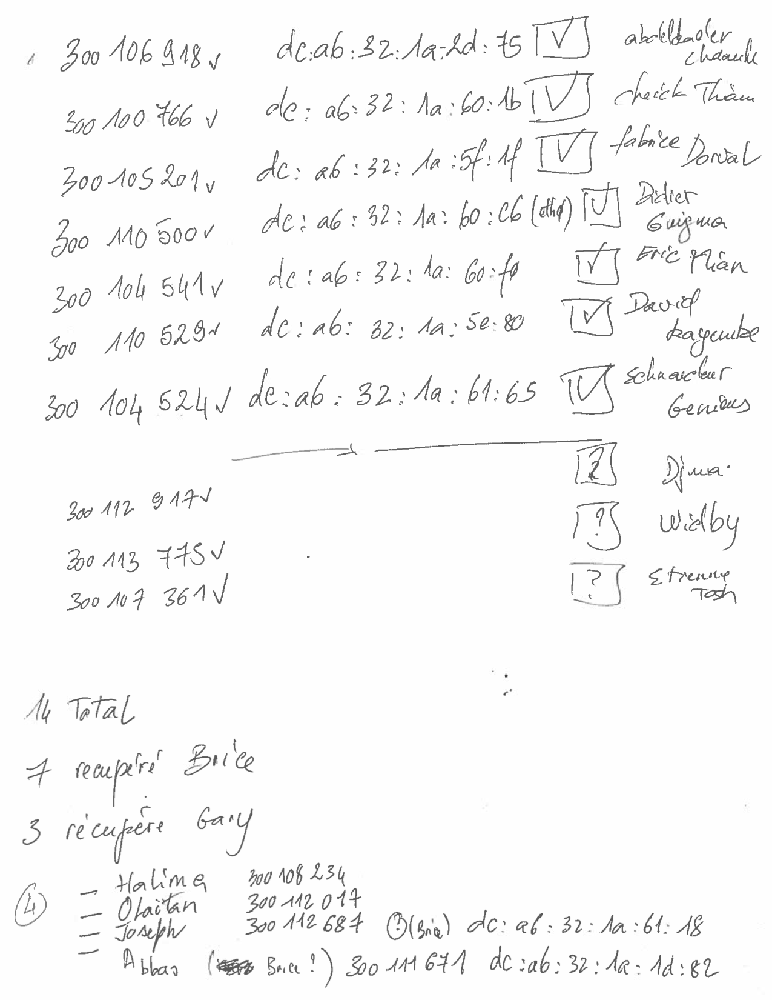

# Raspberry Pi

BR1 : dc:a6:32:1a:5b:63


## [:strawberry: Inventaire](images/19121615_50_24.pdf)
</img>

## [Retour Gary](images/IMG_20200515_145043.jpg)

</img>


```
$ ip addr | grep dc:a6:32:1a
```

