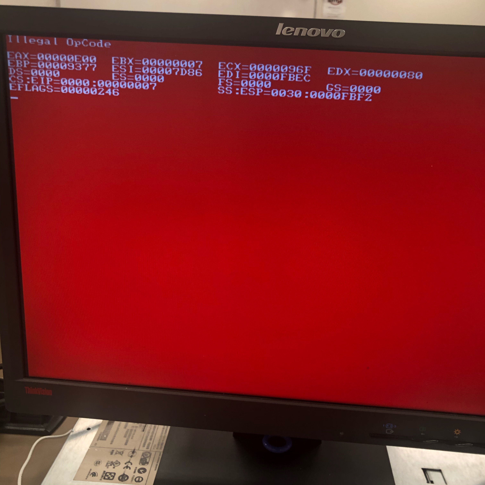

## Materiel HP Proliant Server

| Materiel                | Guide                                                                  |LG|
|-------------------------|------------------------------------------------------------------------|--|
| DL360 G6                | https://support.hpe.com/hpsc/doc/public/display?docId=emr_na-c01728723 |FR|
| DL360 G6 (quick Specs)  | https://h20195.www2.hpe.com/v2/getpdf.aspx/c04284365.pdf               |EN|
| DL380 G7                | https://support.hpe.com/hpsc/doc/public/display?docId=emr_na-c02149854 |EN|


## Installation

| CD                                | Guide                                                         |
|-----------------------------------|---------------------------------------------------------------|
| SmartStart CD pour HP Proliant G7 | https://support.hpe.com/hpsc/doc/public/display?docId=mmr_kc-0121805 |
| SmartStart CD Download Page       |  https://support.hpe.com/hpesc/public/home/result?qt=SmartStart+CD   |


## Utilitaires
| App                               | Guide                                                         |
|-----------------------------------|---------------------------------------------------------------|
|  UnetBooting sur USB stick        | http://unetbootin.github.io/                                  |
|  Rufus (Windows Only) .           | https://rufus.akeo.ie/                                        |


## Raid Setup Utility
 
 
1 . Accessing the Raid Setup Utility on G6 and G7
 
https://www.kevinhooke.com/2017/10/30/accessing-the-raid-setup-on-an-hp-proliant-dl380-g7/
 
 ```
 Pressing F8 to access ILO
 Exiting ILO will give access to Raid Setup Utility
 ```
 
 
2 . Running Raid setup utility and then install Operating system 
 
https://www.youtube.com/watch?v=9osh7X_ozqY
 
 
 
3 . To configure in Raid 5, you need a minimum of 3 disks.


## :warning: Troubleshoot

`red screen of death`

https://alpacapowered.wordpress.com/2014/06/23/illegal-opcode-red-screen-of-death-while-booting-a-hp-proliant-server-from-an-usb-sd-card/



```
DESCRIPTION
In rare instances, a ProLiant DL380p Gen8 server may fail to boot from an SD card or a USB device after frequent reboots while Virtual Media is mounted in the HP Integrated Lights-Out 4 (iLO 4) Integrated Remote Console (IRC).
This issue can occur if the server is rebooted approximately every five minutes. If this occurs, the following message will be displayed: Non-System disk or disk error-replace and strike any key when ready
SCOPE
Any HP ProLiant DL380p Gen8 server with HP Integrated Lights-Out 4 (iLO 4).
RESOLUTION
If a ProLiant DL380p Gen8 server fails to boot from an SD card or a USB device, cold boot the server to recover from this issue.
```
