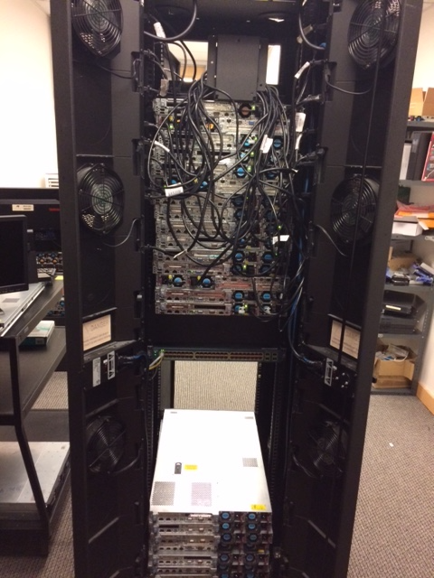
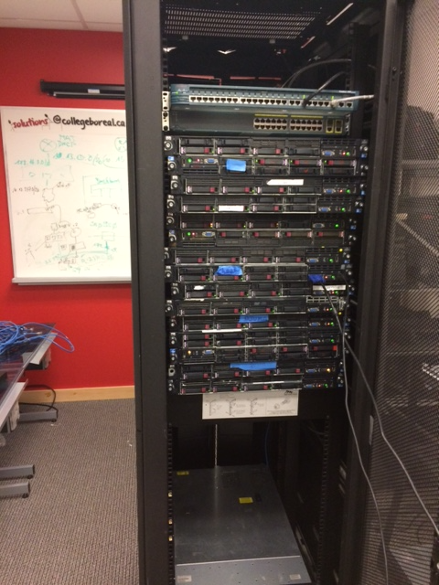
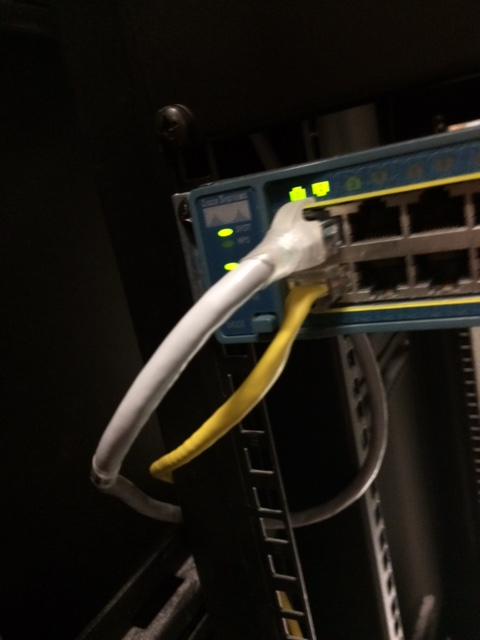

# Salle 3202

## :m: Vue arrière

:pushpin: Partie supérieure du "Rack" en Salle 3202

</img>

## :m: Vue frontale

:pushpin: Partie supérieure du "Rack" en Salle 3202

</img>

## :m: Connection Switch au réseau `10.13.237.0/25`

:pushpin: Switch Catalyst 3600 utilisée uniquement pour les serveurs

:bulb: Couleurs des cables 

* La connection vers le routeur externe est le cable Jaune 💛

</img>

:x: Ne pas débrancher
