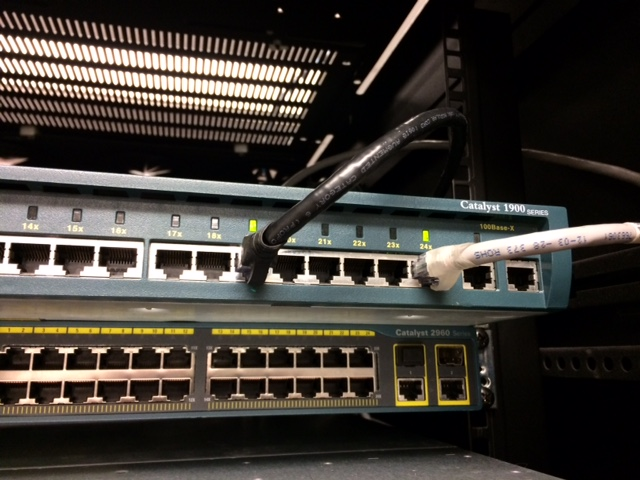

# 2ème années

## :m: Vue arrière

:pushpin: Partie supérieure du "Rack" en Salle 3202

</img>

## :m: Vue frontale

:pushpin: Partie supérieure du "Rack" en Salle 3202

</img>

## :m: Connection Switch 2ème année

:pushpin: Switch Catalyst 1900 100BaseX utilisée uniquement pour les serveurs des 2ème années

Veuillez brancher vos cables "patch" RJ45 sur cette "switch"

</img>

## :m: Connection Switch au réseau `10.13.237.0/25`

:pushpin: Switch Catalyst 3600 utilisée uniquement pour les serveurs des 1ère années et répartiteur

:bulb: Couleurs des cables 

* La connection vers le routeur est le cable Jaune 💛

* La connection vers la switch Catalyst 1900 100BaseX est le cable Gris 🌫️

</img>

:x: Ne pas débrancher
