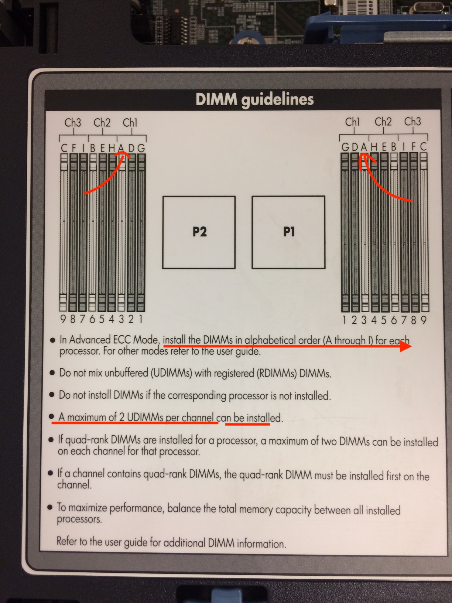

# Memoire

:pushpin: Installer les barretes mémoires en suivant l'ordre des lettres par processeurs [A, B, C, ...]

:pushpin: Pas plus de 2 barrettes par cannaux [CH1, CH2, ...]

:pushpin: COmmencer à installer les barrettes ayant le plus de capacité mémoire d'abord (i.e. 16Gb, 8Gb. 4Gb)

</img>
