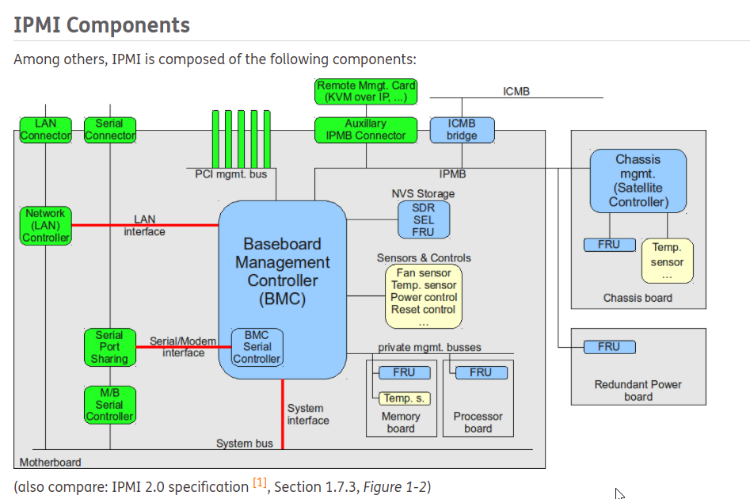

# IPMI



## :a: IPMI Tool

- [ ] :one Install

```
sudo apt install ipmitool
```

- [ ] :two: Usage

```
sudo ipmitool
```
> Return
```
No command provided!
Commands:
        raw           Send a RAW IPMI request and print response
        i2c           Send an I2C Master Write-Read command and print response
        spd           Print SPD info from remote I2C device
        lan           Configure LAN Channels
        chassis       Get chassis status and set power state
        power         Shortcut to chassis power commands
        event         Send pre-defined events to MC
        mc            Management Controller status and global enables
        sdr           Print Sensor Data Repository entries and readings
        sensor        Print detailed sensor information
        fru           Print built-in FRU and scan SDR for FRU locators
        gendev        Read/Write Device associated with Generic Device locators sdr
        sel           Print System Event Log (SEL)
        pef           Configure Platform Event Filtering (PEF)
        sol           Configure and connect IPMIv2.0 Serial-over-LAN
        tsol          Configure and connect with Tyan IPMIv1.5 Serial-over-LAN
        isol          Configure IPMIv1.5 Serial-over-LAN
        user          Configure Management Controller users
        channel       Configure Management Controller channels
        session       Print session information
        dcmi          Data Center Management Interface
        nm            Node Manager Interface
        sunoem        OEM Commands for Sun servers
        kontronoem    OEM Commands for Kontron devices
        picmg         Run a PICMG/ATCA extended cmd
        fwum          Update IPMC using Kontron OEM Firmware Update Manager
        firewall      Configure Firmware Firewall
        delloem       OEM Commands for Dell systems
        shell         Launch interactive IPMI shell
        exec          Run list of commands from file
        set           Set runtime variable for shell and exec
        hpm           Update HPM components using PICMG HPM.1 file
        ekanalyzer    run FRU-Ekeying analyzer using FRU files
        ime           Update Intel Manageability Engine Firmware
        vita          Run a VITA 46.11 extended cmd
        lan6          Configure IPv6 LAN Channels
```

- [ ] :three: Users

* [ ] [How to reset HP iLO Lights-Out User and Password Settings with IPMItool](https://russell.ballestrini.net/how-to-reset-hp-ilo-lights-out-user-and-password-settings-with-ipmitools)

* Help

```
sudo ipmitool user 
```
> Outputs :
<pre>
Not enough parameters given.
User Commands:
               summary      [<channel number>]
               list         [<channel number>]
               set name     <user id> <username>
               set password <user id> [<password> <16|20>]
               disable      <user id>
               enable       <user id>
               priv         <user id> <privilege level> [<channel number>]
                     Privilege levels:
                      * 0x1 - Callback
                      * 0x2 - User
                      * 0x3 - Operator
                      * 0x4 - Administrator
                      * 0x5 - OEM Proprietary
                      * 0xF - No Access

               test         <user id> <16|20> [<password]>
</pre>

* Channel 2 is used (by trial and errror)

```
sudo ipmitool user summary 2
```
> Outputs :
<pre>
Maximum IDs	    : 12
Enabled User Count  : 1
Fixed Name Count    : 0
</pre>

```
sudo ipmitool user list 2
```
> Outputs :
<pre>
ID  Name	     Callin  Link Auth	IPMI Msg   Channel Priv Limit
1   Administrator    true    false      true       ADMINISTRATOR
2   (Empty User)     true    false      false      NO ACCESS
3   (Empty User)     true    false      false      NO ACCESS
4   (Empty User)     true    false      false      NO ACCESS
5   (Empty User)     true    false      false      NO ACCESS
6   (Empty User)     true    false      false      NO ACCESS
7   (Empty User)     true    false      false      NO ACCESS
8   (Empty User)     true    false      false      NO ACCESS
9   (Empty User)     true    false      false      NO ACCESS
10  (Empty User)     true    false      false      NO ACCESS
11  (Empty User)     true    false      false      NO ACCESS
12  (Empty User)     true    false      false      NO ACCESS
</pre>

* let's play with user `admin` by creating on on ID 2

```
sudo ipmitool user set name 2 admin
```

```
sudo ipmitool user set password 2 mynew-password
```
> Set User Password command successful (user 2)

```
sudo ipmitool user set password 2 my-password
```
> Set User Password command successful (user 2)


```
sudo ipmitool user set password 2
```
<pre>
Password for user 2: 
Password for user 2: 
Set User Password command successful (user 2)
</pre>


* Password format

```
sudo ipmitool user set password 2 my-pwd
```
  IPMI command failed: Unknown (0x81)
  Set User Password command failed (user 2)

```
sudo ipmitool user set password 2 mynew-
```
  IPMI command failed: Unknown (0x81)
  Set User Password command failed (user 2)

```
sudo ipmitool user set password 2 boreal
```
  IPMI command failed: Unknown (0x81)
  Set User Password command failed (user 2)

* Privilege Level (USER by Default)

```
sudo ipmitool user priv 2 0x4 2
```
> Set Privilege Level command successful (user 2)

```
sudo ipmitool user list 2
```
<pre>
ID  Name	     Callin  Link Auth	IPMI Msg   Channel Priv Limit
1   Administrator    true    false      true       ADMINISTRATOR
2   admin            true    false      true       ADMINISTRATOR
3   (Empty User)     true    false      false      NO ACCESS
4   (Empty User)     true    false      false      NO ACCESS
5   (Empty User)     true    false      false      NO ACCESS
6   (Empty User)     true    false      false      NO ACCESS
7   (Empty User)     true    false      false      NO ACCESS
8   (Empty User)     true    false      false      NO ACCESS
9   (Empty User)     true    false      false      NO ACCESS
10  (Empty User)     true    false      false      NO ACCESS
11  (Empty User)     true    false      false      NO ACCESS
12  (Empty User)     true    false      false      NO ACCESS
</pre>

* Enable `admin`

```
sudo ipmitool user enable 2
```


```
sudo ipmitool mc info
```
> Return
```
Device ID                 : 19
Device Revision           : 1
Firmware Revision         : 1.28
IPMI Version              : 2.0
Manufacturer ID           : 11
Manufacturer Name         : Hewlett-Packard
Product ID                : 8192 (0x2000)
Product Name              : Unknown (0x2000)
Device Available          : yes
Provides Device SDRs      : yes
Additional Device Support :
    Sensor Device
    SDR Repository Device
    SEL Device
    FRU Inventory Device
```


 - [ ] To See Only the Temperature, Voltage, and Fan Sensors - SDR (Sensor Data Record)

```
sudo ipmitool sdr elist full
```
> Return
```
VRM 1            | 01h | ok  |  9.1 | Device Present
VRM 2            | 02h | ok  |  9.2 | Device Present
UID Light        | 03h | ok  | 23.1 |
Int. Health LED  | 04h | ok  | 23.2 |
Ext. Health LED  | 05h | ok  | 23.3 |
Power Supply 1   | 06h | ok  | 10.1 | 0 Watts, Presence detected, Failure detected
Power Supply 2   | 07h | ok  | 10.2 | 95 Watts, Presence detected
Power Supplies   | 08h | ok  | 10.3 | Non-Redundant: Sufficient from Redundant
Fan Block 1      | 09h | ok  |  7.1 | 21.56 percent, Transition to Running
Fan Block 2      | 0Ah | ok  |  7.2 | 21.56 percent, Transition to Running
Fan Block 3      | 0Bh | ok  |  7.3 | 21.56 percent, Transition to Running
Fan Block 4      | 0Ch | ok  |  7.4 | 21.56 percent, Transition to Running
Fans             | 0Dh | ok  |  7.5 | 0 percent, Fully Redundant
Temp 1           | 0Eh | ok  | 64.1 | 20 degrees C
Temp 2           | 0Fh | ok  | 65.1 | 40 degrees C
Temp 3           | 10h | ok  | 65.2 | 40 degrees C
Temp 4           | 11h | ns  |  8.1 | Disabled
Temp 5           | 12h | ok  |  8.2 | 36 degrees C
Temp 6           | 13h | ok  |  8.3 | 33 degrees C
Temp 7           | 14h | ok  |  8.4 | 34 degrees C
Temp 8           | 15h | ok  |  8.5 | 33 degrees C
Temp 9           | 16h | ok  |  8.6 | 32 degrees C
Temp 10          | 17h | ok  |  8.7 | 32 degrees C
Temp 11          | 18h | ok  |  8.8 | 32 degrees C
Temp 12          | 19h | ok  | 10.4 | 32 degrees C
Temp 13          | 1Ah | ok  | 10.5 | 49 degrees C
Temp 14          | 1Bh | ok  |  8.9 | 31 degrees C
Temp 15          | 1Ch | ok  | 65.3 | 33 degrees C
Temp 16          | 1Dh | ok  | 65.4 | 29 degrees C
Temp 17          | 1Eh | ok  |  8.10 | 30 degrees C
Temp 18          | 1Fh | ok  | 65.5 | 40 degrees C
Temp 19          | 20h | ok  |  5.1 | 37 degrees C
Temp 20          | 21h | ok  |  5.2 | 40 degrees C
Temp 21          | 22h | ok  |  5.3 | 48 degrees C
Temp 22          | 23h | ok  |  5.4 | 50 degrees C
Temp 23          | 24h | ok  |  5.5 | 43 degrees C
Temp 24          | 25h | ok  |  5.6 | 50 degrees C
Temp 25          | 26h | ok  |  5.7 | 37 degrees C
Temp 26          | 27h | ok  |  5.8 | 48 degrees C
Temp 27          | 28h | ok  | 15.1 | 35 degrees C
Temp 28          | 29h | ok  | 66.1 | 73 degrees C
Power Meter      | 2Ah | ok  |  7.6 | 100 Watts, Device Enabled
Memory           | 2Bh | ok  |  7.7 | Correctable ECC, Correctable ECC logging limit reached, Presence Detected
```

Amps = Watts / Voltage - In this example, 100Watts / 120V = 0.8333 - if 40 servers,  33 Amps which is high for 30A limit per cable

- [ ] To See All SDR Entities

```
sudo ipmitool sdr entity
```
> Return
```
Entity IDs:

     0  Unspecified                            1  Other
     2  Unknown                                3  Processor
     4  Disk or Disk Bay                       5  Peripheral Bay
     6  System Management Module               7  System Board
     8  Memory Module                          9  Processor Module
    10  Power Supply                          11  Add-in Card
    12  Front Panel Board                     13  Back Panel Board
    14  Power System Board                    15  Drive Backplane
    16  System Internal Expansion Board       17  Other System Board
    18  Processor Board                       19  Power Unit
    20  Power Module                          21  Power Management
    22  Chassis Back Panel Board              23  System Chassis
    24  Sub-Chassis                           25  Other Chassis Board
    26  Disk Drive Bay                        27  Peripheral Bay
    28  Device Bay                            29  Fan Device
    30  Cooling Unit                          31  Cable/Interconnect
    32  Memory Device                         33  System Management Software
    34  BIOS                                  35  Operating System
    36  System Bus                            37  Group
    38  Remote Management Device              39  External Environment
    40  Battery                               41  Processing Blade
    42  Connectivity Switch                   43  Processor/Memory Module
    44  I/O Module                            45  Processor/IO Module
    46  Management Controller Firmware        47  IPMI Channel
    48  PCI Bus                               49  PCI Express Bus
    50  SCSI Bus (parallel)                   51  SATA/SAS Bus
    52  Processor/Front-Side Bus              53  Real Time Clock(RTC)
    54  Reserved                              55  Air Inlet
    56  Reserved                              57  Reserved
    58  Reserved                              59  Reserved
    60  Reserved                              61  Reserved
    62  Reserved                              63  Reserved
    64  Air Inlet                             65  Processor
    66  Baseboard/Main System Board          160  PICMG Front Board
   192  PICMG Rear Transition Module         193  PICMG AdvancedMC Module
   240  PICMG Shelf Management Controller     241  PICMG Filtration Unit
   242  PICMG Shelf FRU Information          243  PICMG Alarm Panel
```

- [ ] To See All Fan-Related Sensors

```
sudo ipmitool sdr entity 29
```

- [ ] To See All SEL (System Event Log)

```
sudo ipmitool sel list
```
> Return
```
   0 | 06/29/2021 | 08:18:06 | Memory #0x2b | Correctable ECC logging limit reached | Asserted
   1 | 11/03/2021 | 15:01:48 | Memory #0x2b | Correctable ECC logging limit reached | Asserted
```

- [ ] To See All SEL Data (from the previous event table, 1st column event :id:)

```
sudo ipmitool sel get 0
```
> Return
```
SEL Record ID          : 0000
 Record Type           : 00
 Timestamp             : 06/29/2021 08:18:06
 Generator ID          : 0041
 EvM Revision          : 04
 Sensor Type           : Memory
 Sensor Number         : 2b
 Event Type            : Sensor-specific Discrete
 Event Direction       : Assertion Event
 Event Data            : 05ffff
 Description           : Correctable ECC logging limit reached
```

- [ ] Clear the SEL table

* Play the command

```
sudo ipmitool sel clear
```
> Return
```
Clearing SEL.  Please allow a few seconds to erase.
```

* get the results

```
sudo ipmitool sel list
```
> Return
```
SEL has no entries
```

- [ ] To Read the FRU Inventory Information - examples

```
sudo ipmitool fru print
```
> Return
```
FRU Device Description : Builtin FRU Device (ID 0)
 Chassis Type          : Rack Mount Chassis
 Chassis Serial        :
 Board Mfg Date        : Mon Jan  1 00:00:00 1996
 Board Mfg             : HP
 Board Product         : ProLiant DL360 G7
 Board Serial          :
 Board Part Number     :
 Product Manufacturer  : HP
 Product Name          : ProLiant DL360 G7
 Product Part Number   :
 Product Serial        :
 Product Asset Tag     :
```

```
sudo ipmitool fru print
```
> Return
```
FRU Device Description : Builtin FRU Device (ID 0)
 Chassis Type          : Rack Mount Chassis
 Chassis Part Number   :
 Chassis Serial        :
 Board Mfg Date        : Mon Jan  1 00:00:00 1996
 Board Mfg             : HP
 Board Product         : ProLiant DL360 G6
 Board Serial          :
 Board Part Number     :
 Product Manufacturer  : HP
 Product Name          : ProLiant DL360 G6
 Product Part Number   :
 Product Serial        :
 Product Asset Tag     :
```

## :b: Others [FRU](https://linux.die.net/man/8/ipmi-fru) Field Replaceable Unit tool

```
sudo apt install freeipmi-tools
```

```
sudo ipmi-fru
```
> Return
```
Caching SDR repository information: /root/.freeipmi/sdr-cache/sdr-cache-dave-serveur.localhost
Caching SDR record 46 of 46 (current record ID 45)
FRU Inventory Device: Default FRU Device (ID 00h)

  FRU Chassis Type: Rack Mount Chassis
  FRU Chassis Part Number:
  FRU Chassis Serial Number:

  FRU Board Manufacturing Date/Time: 01/01/96 - 00:00:00
  FRU Board Manufacturer: HP
  FRU Board Product Name: ProLiant DL360 G6
  FRU Board Serial Number:
  FRU Board Part Number:

  FRU Error: product info area checksum invalid
```

:bulb: use `sudo ipmitool fru print` printout is similar and without error

## :x: Error

:one: sudo

- [ ] `sudo` command required
   - [ ] [Ubuntu Linux Server - Configuration Required for IPMITOOL Management Utility to Function on any HP ProLiant Server With an Integrated Lights-Out 2 (iLO 2) and Running Ubuntu Linux 9.04 Server](https://support.hpe.com/hpesc/public/docDisplay?docId=emr_na-c01930307)

DESCRIPTION

On an HP ProLiant server with an Integrated Lights-Out 2 (iLO 2) and running Ubuntu Linux Server, the Linux IPMI management utility, IPMITOOL, does not function. For example, when typing the following command:


```
ipmitool
```
> Could not open device at /dev/ipmi0 or /dev/ipmi/0 or /dev/ipmidev/0: No such file or directory

- [ ] Resolution 

Verifiy that the following devices exist: /dev/ipmi0 or /dev/ipmi1

```
ls -l /dev/ipmi*
```
> Return
```
crw------- 1 root root 240, 0 Nov 24 03:52 /dev/ipmi0
```


:two: IPMI command failed: Invalid command on LUN

- [ ] [IPMI command failed: Invalid command on LUN](https://www.reddit.com/r/homelab/comments/5z0gl1/ilo_ipmi_being_weird_invalid_command_on_lun)

```
sudo ipmitool user list
```
> IPMI command failed: Invalid command on LUN

:three: Users wrong channel number

```
sudo ipmitool user list /h
```
> Outputs :
<pre>
Given Channel number '/h' is either invalid or out of range.
Channel number must be from ranges: <0x0..0xB>, <0xE..0xF>
</pre>


## :ab: Test

```
sudo ipmitool -I lan -H betelgeuse.orion.gasy.africa -U admin chassis power status
```

# References

- [ ] [Using IPMItool to View System Information](https://docs.oracle.com/cd/E19464-01/820-6850-11/IPMItool.html)
- [ ] [IPMI Basics](https://www.thomas-krenn.com/en/wiki/IPMI_Basics)
