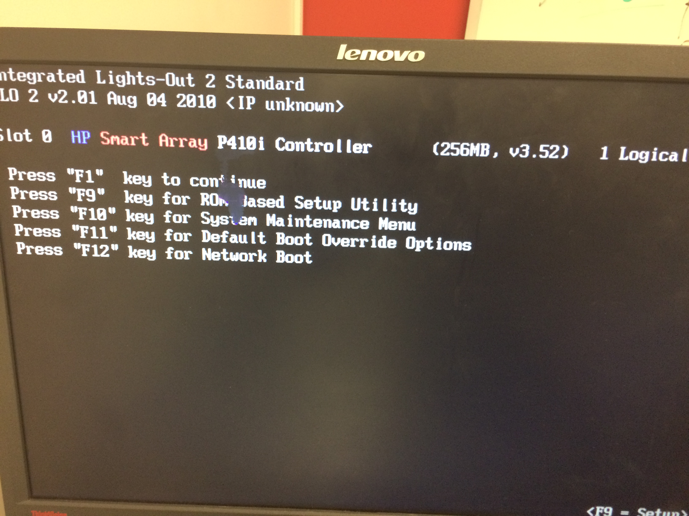
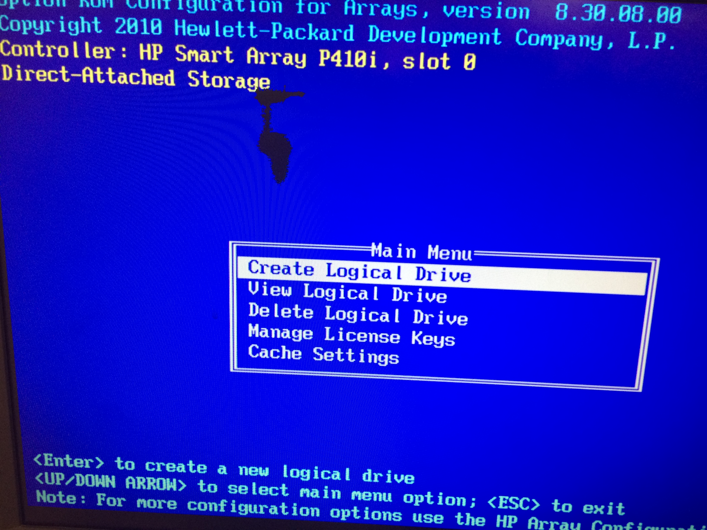
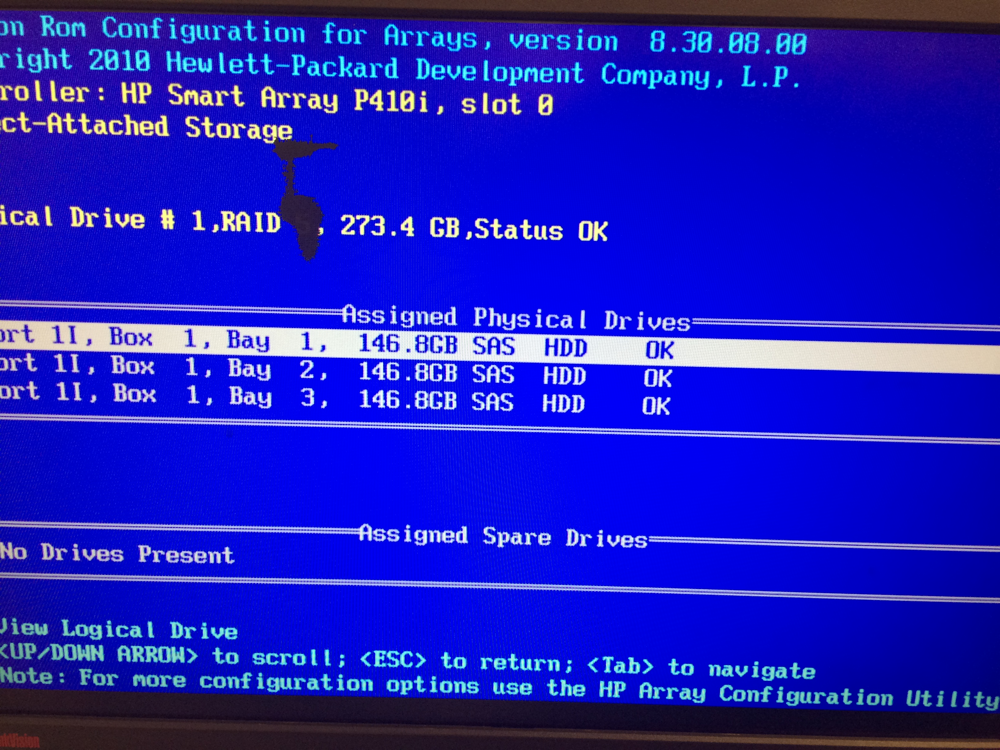
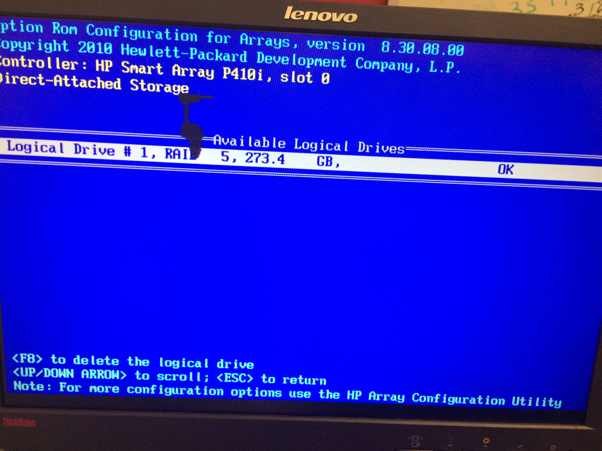
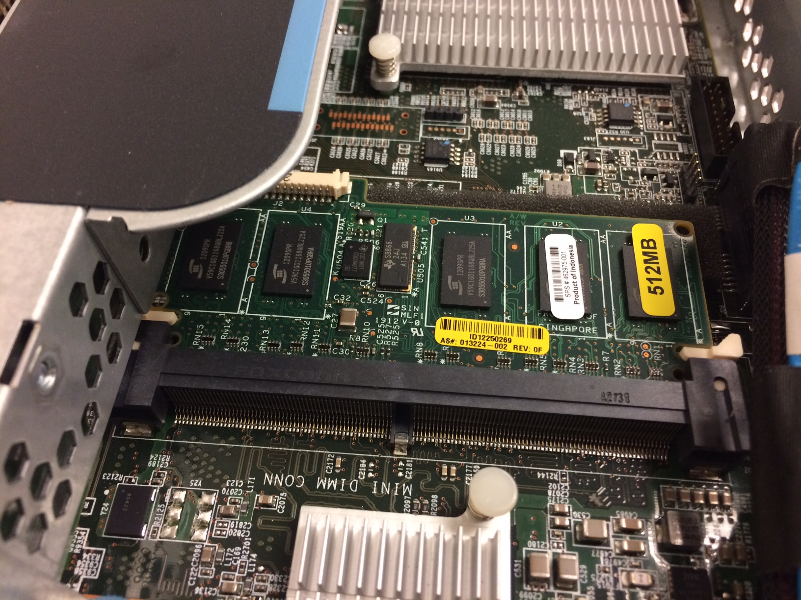
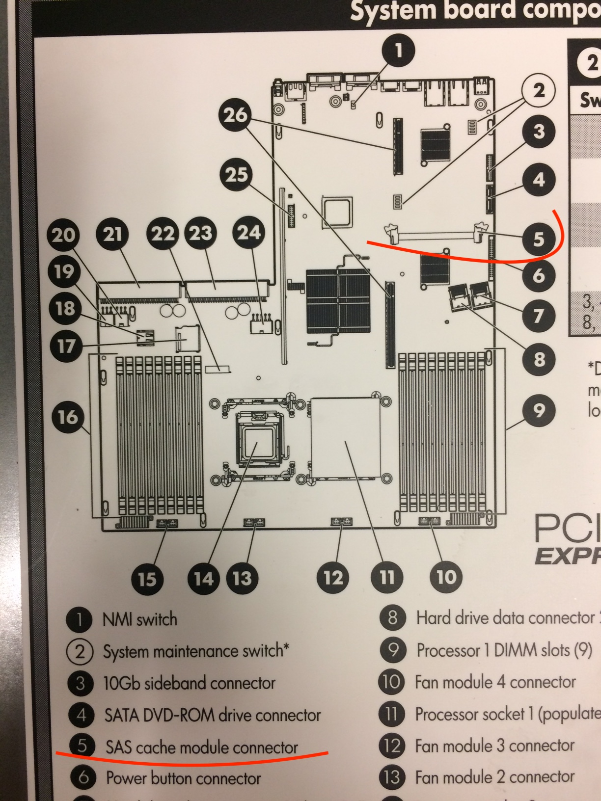
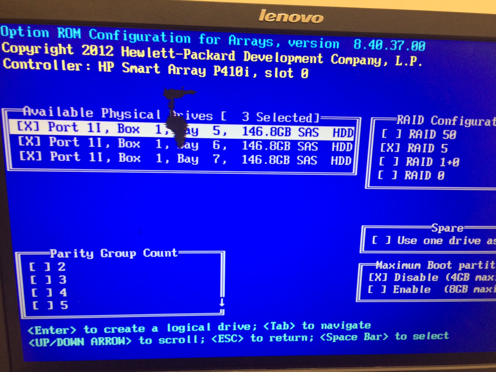

# Raid Setup Utility
  
## :a: Accessing the `Raid Setup Utility` on G6 and G7
 
https://www.kevinhooke.com/2017/10/30/accessing-the-raid-setup-on-an-hp-proliant-dl380-g7/
 
    Pressing F8 to access ILO
    Exiting ILO will give access to Raid Setup Utility
 
 
 
## :b: Logical Drives

* To configure Disks in [Raid 5](https://www.computerweekly.com/answer/RAID-5-recovery-What-is-the-maximum-number-of-physical-drives-in-a-RAID-5-configuration), you need a minimum of 3 disks.

:one: Create a Logical Drive

:two: Assign Physical Drives

:three: Check Logical Drives

## :ab: TroubleShooting Smart Array P410i Controller

</img>

</img>

</img>

# Référence

* Running Raid setup utility and then install Operating system 
 
https://www.youtube.com/watch?v=9osh7X_ozqY

* HP P410/P410i Array Configuration Guide

https://techmikeny.com/pages/hp-p410-p410i-array-configuration-guide
 
