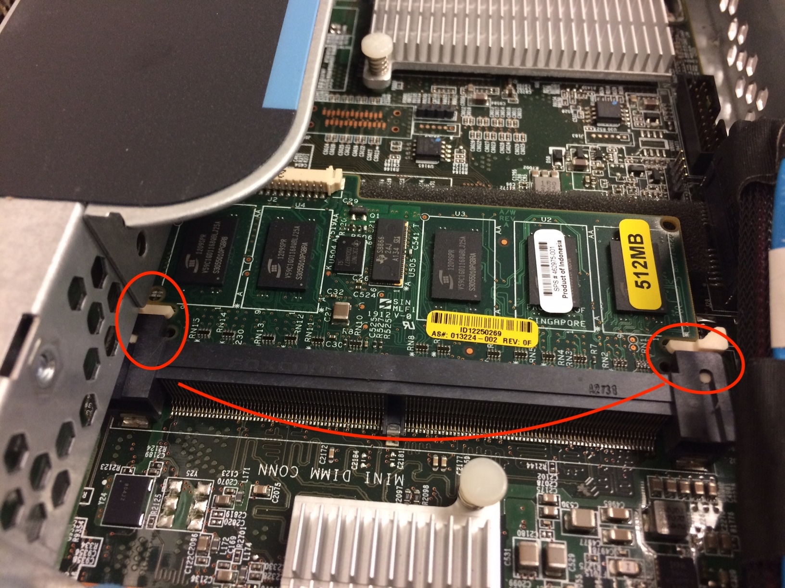

# Raid Setup Utility
  
## :a: Accessing the `Raid Setup Utility` on G6 and G7
 
https://www.kevinhooke.com/2017/10/30/accessing-the-raid-setup-on-an-hp-proliant-dl380-g7/
 
    Pressing F8 to access ILO
    Exiting ILO will give access to Raid Setup Utility
 
 
 
## :b: Logical Drives

* To configure Disks in [Raid 5](https://www.computerweekly.com/answer/RAID-5-recovery-What-is-the-maximum-number-of-physical-drives-in-a-RAID-5-configuration), you need a minimum of 3 disks.

:one: Create a Logical Drive

:two: Assign Physical Drives

:three: Check Logical Drives

## :ab: TroubleShooting RAID Cache Module Controller 

When the SAS 

:bulb: (a.k.a HP Smart Array P410i Controller)

:pushpin: HP Smart Array P410i Controller

</img>

:pushpin: Place into the connector #5 on the board 

</img>

:pushpin: Only with the controller that RAID5 functionnality is ON (otherwise only RAID0 is ON)

</img>

### :x: Ensure that Disk Controller is enabled in Computer's BIOS menu

error message that "You Cannot install the OS on this Drive" and "Windows Cannot be installed on this disk, the Computer Hardware may not support booting to this disk, Ensure that Disk Controller is enabled in Computer's BIOS menu"

https://community.hpe.com/t5/ProLiant-Servers-ML-DL-SL/HP-proliant-380-G7-Server-not-Detecting-the-Hard-Drives/m-p/6206927#M138410

# Référence

* Running Raid setup utility and then install Operating system 
 
https://www.youtube.com/watch?v=9osh7X_ozqY

* HP P410/P410i Array Configuration Guide

https://techmikeny.com/pages/hp-p410-p410i-array-configuration-guide
 
