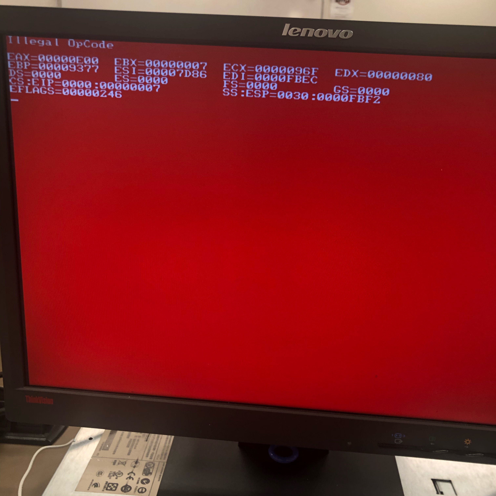

## :warning: Troubleshoot

### :pushpin: `red screen of death`

https://alpacapowered.wordpress.com/2014/06/23/illegal-opcode-red-screen-of-death-while-booting-a-hp-proliant-server-from-an-usb-sd-card/

</img>

```
DESCRIPTION
In rare instances, a ProLiant DL380p Gen8 server may fail to boot from an SD card or a USB device after frequent reboots while Virtual Media is mounted in the HP Integrated Lights-Out 4 (iLO 4) Integrated Remote Console (IRC).
This issue can occur if the server is rebooted approximately every five minutes. If this occurs, the following message will be displayed: Non-System disk or disk error-replace and strike any key when ready
SCOPE
Any HP ProLiant DL380p Gen8 server with HP Integrated Lights-Out 4 (iLO 4).
RESOLUTION
If a ProLiant DL380p Gen8 server fails to boot from an SD card or a USB device, cold boot the server to recover from this issue.
```

### :pushpin: `Troubleshooting the USB Port or Device`


https://community.hpe.com/t5/ProLiant-Servers-ML-DL-SL/DL180-USB-ports-disabled-LO100-KVM-keyboard-amp-mouse-don-t-work/td-p/5248034#


    but I removed the CMOS battery and left it for a while - 
    this reset the BIOS settings and the USB ports worked again.

https://support.hpe.com/hpsc/doc/public/display?docId=emr_na-lpn13770

 Confirming USB port configuration
 Follow the directions in this section to answer the following questions, or as many as possible:

 Is the USB port enabled?
 To determine if the USB port is enabled or disabled, access the BIOS Setup Utility by pressing F2 during POST.
 NOTE: If parameters are changed in the BIOS it may affect the computer’s performance, or the computer may not restart. For more information, consult the User’s guide.
 Verify that the USB port is set to ENABLED.

 Exit the BIOS Setup Utility and save any changes. The system will complete its startup procedure.

### :pushpin: Enabling Virtualization

https://support.hpe.com/hpsc/doc/public/display?docId=emr_na-kc0121549en_us&docLocale=en_US

