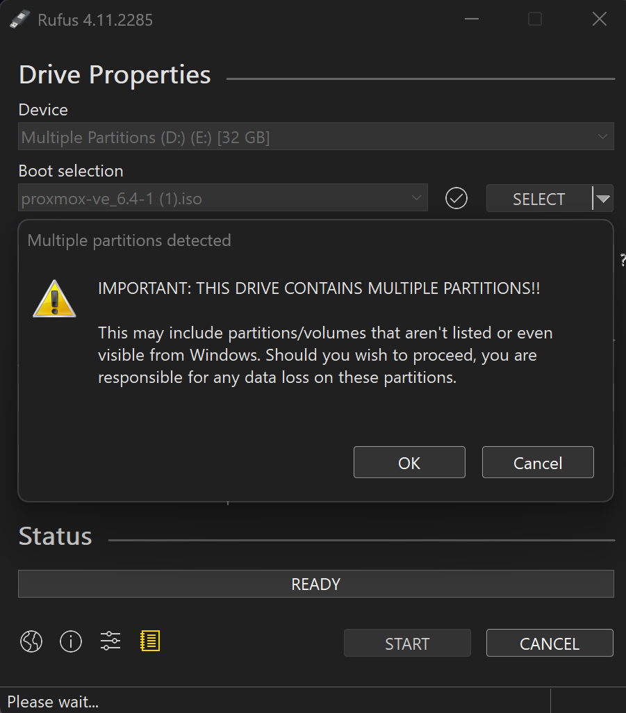
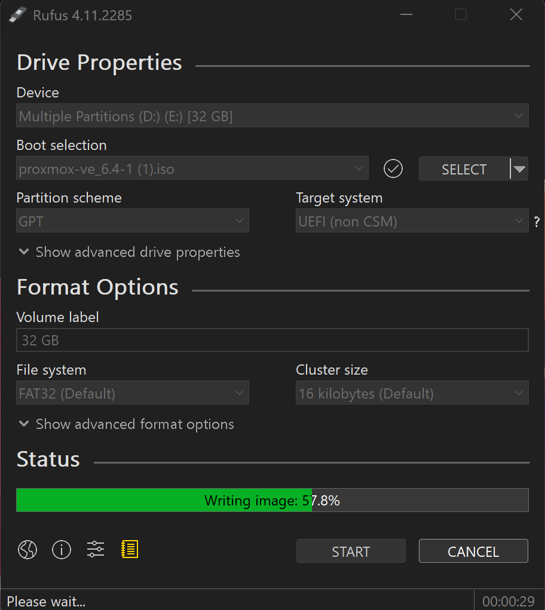
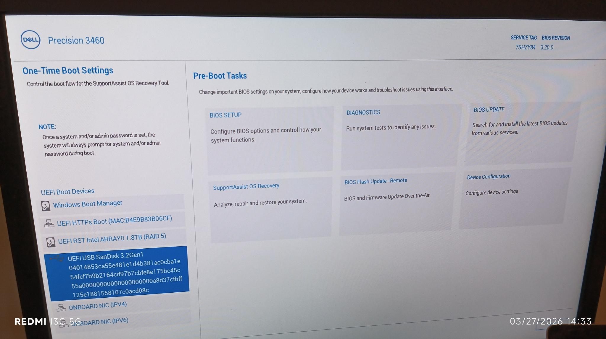
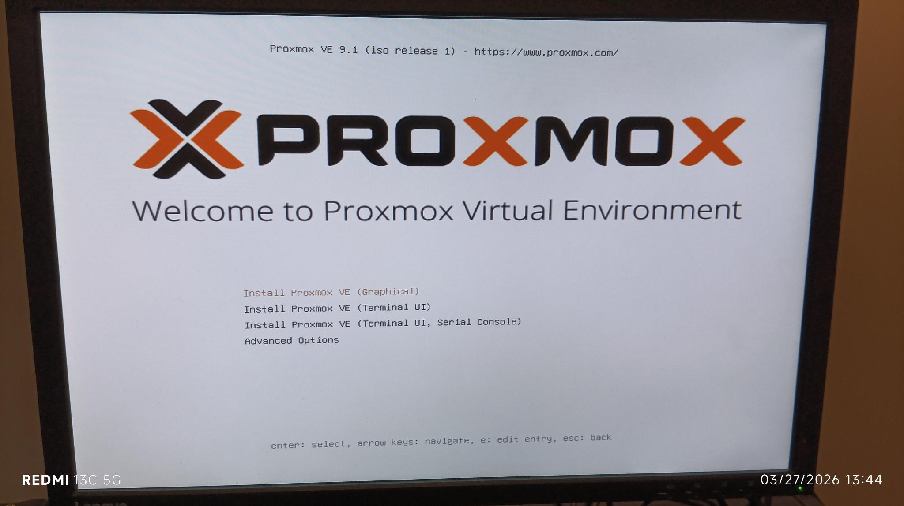
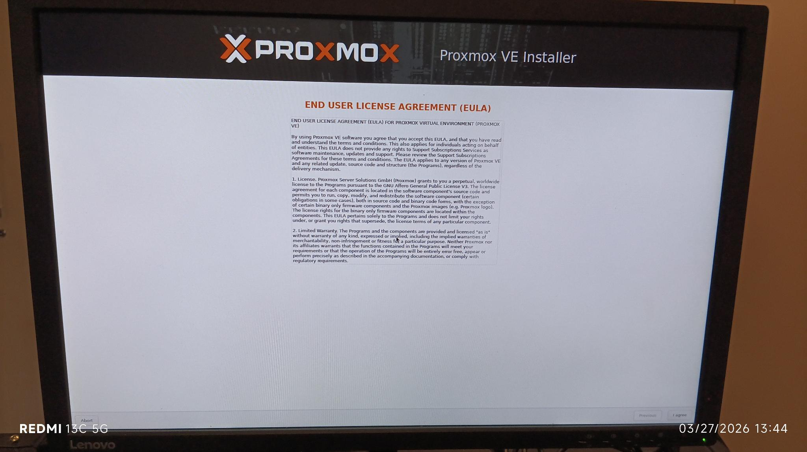
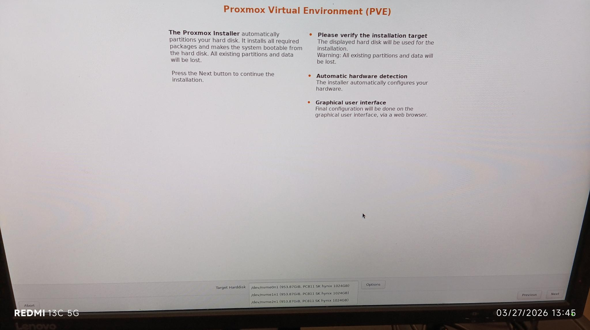
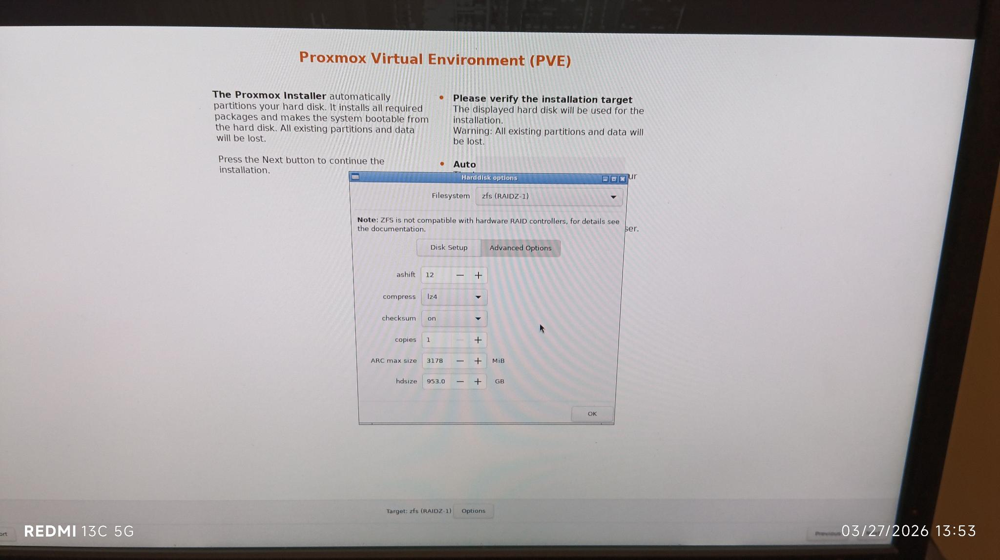
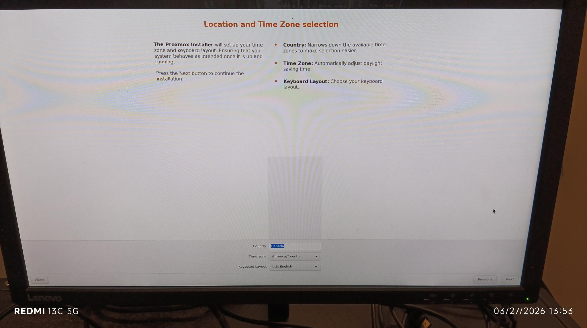
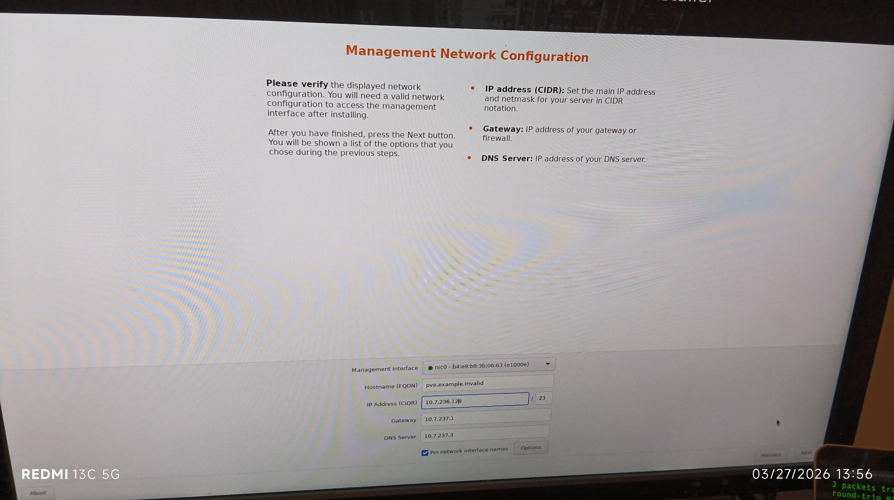
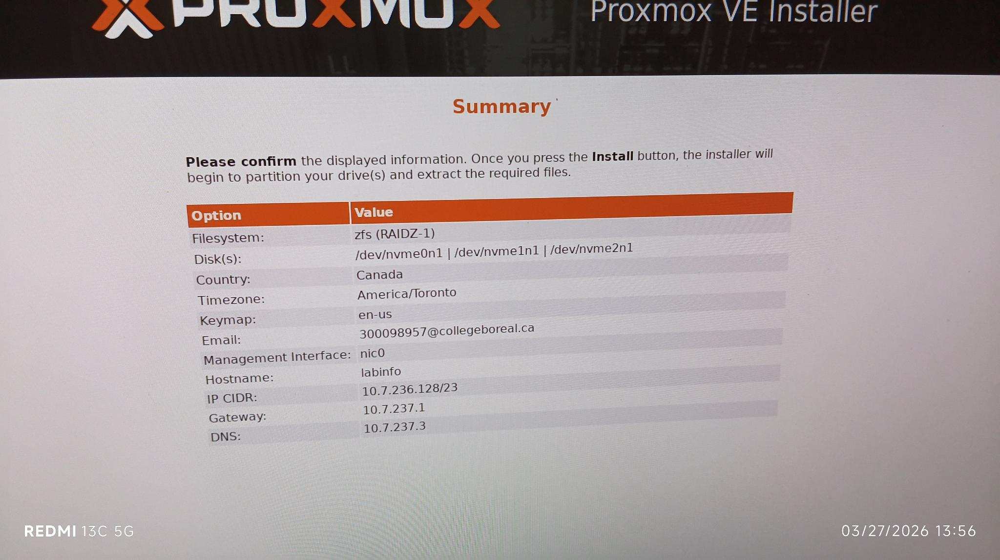

# 💻 Proxmox VE Installation – Dell Precision 3460 SFF Workstation

## 🎯 Objectif
L’objectif de ce projet est de reconfigurer le Dell Precision 3460 SFF Workstation et d’installer **Proxmox VE** avec la configuration suivante :

### ⚙️ Caractéristiques principales

* **Format :** Small Form Factor (SFF) → compact mais limité en upgrade GPU
* **CPU :** Intel Core i7 (12e → 14e gen)
* **RAM :** DDR5 jusqu’à 32 GB
* **Stockage :**

  * NVMe PCIe Gen4
  * * SATA (plusieurs disques possibles)
* **GPU :**

  * intégré Intel
  * ou pro (NVIDIA RTX A-series / AMD Radeon Pro)
* **Alimentation :** 260W ou 300W
* **Ports :**

  * USB-C, USB 3.x
  * 3x DisplayPort
  * Ethernet (pas de Wi-Fi par défaut)

👉 Exemple typique : i5-14500, 16 GB RAM, SSD 512 GB ([dell.com][1])

---

### 💪 Points forts

- ✔️ **Très fiable (gamme workstation Dell)**
- ✔️ **Compact → parfait pour bureau / rack léger / homelab**
- ✔️ **Silencieux au repos**
- ✔️ **Supporte Linux, Proxmox, ESXi, Windows Server**

👉 Beaucoup l’utilisent comme petit serveur ou node de virtualisation.

---

### ⚠️ Limitations importantes

- ❌ **GPU limité (low-profile uniquement)**
- ❌ **PSU faible (260–300W)** → bloque upgrades GPU puissants
- ❌ **Refroidissement compact → bruit en charge possible**
- ❌ **Peu de place pour upgrades comparé à une tour**

💡 Exemple réel (retour communauté) :

> alimentation limite pour GPU type RTX → upgrade compliqué
---

[1]: https://www.dell.com/en-ca/shop/desktop-computers/precision-3460-small-form-factor/spd/precision-3460-workstation/s301dpt3460sffcavp?view=configurations&utm_source=chatgpt.com "Precision 3460 Small Form Factor | Dell Canada"


---

## 🧰 Phase 1 : Préparation des outils

### # Step 1 : Télécharger Proxmox 
- Aller sur le site officiel de **Proxmox VE**
- Télécharger le fichier **ISO**

```bash
curl https://enterprise.proxmox.com/iso/proxmox-ve_9.1-1.iso -o proxmox-ve_9.1-1.iso
```

```powershell
  % Total    % Received % Xferd  Average Speed   Time    Time     Time  Current
                                 Dload  Upload   Total   Spent    Left  Speed
100  885M  100  885M    0     0  68.3M      0  0:00:12  0:00:12 --:--:-- 70.2M
```

### # Step 2 : Télécharger Rufus
- Aller sur le site officiel de **Rufus**
- Télécharger le logiciel
  
 | Logiciel       | Lien officiel                          |
 |----------------|----------------------------------------|
 | Proxmox VE ISO | [https://www.proxmox.com/en/](https://www.proxmox.com/en/) |
 | Rufus          | [https://rufus.ie/fr/](https://rufus.ie/fr/) |

### # Step 3 : Créer la clé USB bootable 🔑
- Insérer une clé USB
- Ouvrir **Rufus**
- Sélectionner l’image ISO de **Proxmox VE**
- Cliquer sur **Start**

 

📌 ## Attendre la fin de la création iso avant de retirer USB

 

📌## Retirer la cle USB maintenant 


---


## 🚀 Phase 3 : Démarrage sur la clé USB

### # Step 7 : Boot sur USB 🔌 vi UEFI
- Redémarrer le serveur
- Appuyer sur **F12**  (Dell)
- Sélectionner la clé USB

---

## 📦 Phase 4 : Installation de Proxmox VE










### # Step 8 : Installation

